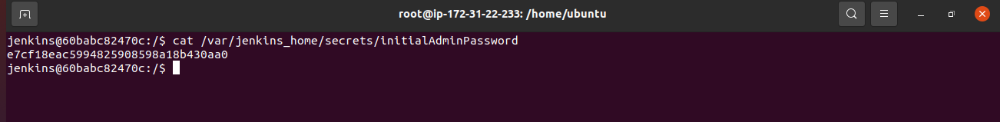
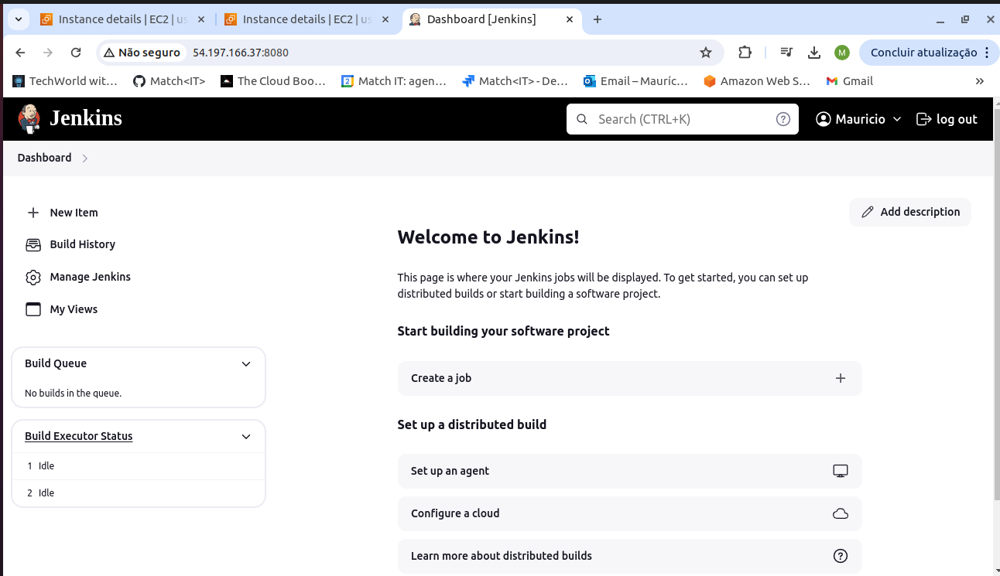
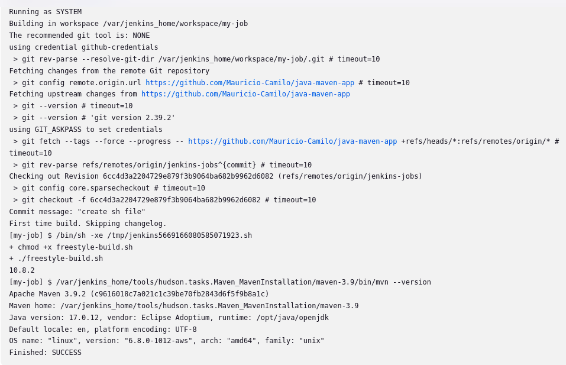
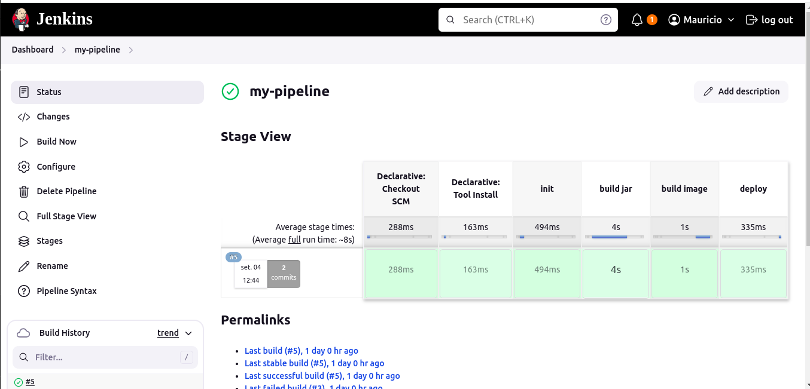

# Demo Project 1

Install Jenkins on DigitalOcean

## Technologies Used

Jenkins, Docker, DigitalOcean, Linux

## Project Description

- Create an Ubuntu server on DigitalOcean
- Set up and run Jenkins as Docker container
- Initialize Jenkins

### Details of project

- Create new server on Cloud

  A new server was created with a minimum of 2 vCPUs and 4 GB of RAM to host Jenkins. In this case, I used an AWS EC2 instance. Port 8080 was opened in the firewall to allow access to 
  Jenkins via a browser.

- Install docker on server to run Jenkins

  The first step was to install Docker on this new server, and then run the following command:

  ```
  docker run -p 8080:8080 -p 50000:50000 -d -v jenkins_home:/var/jenkins_home jenkins/jenkins:lts
  ```
  
  This command pulls Jenkins from Docker Hub, running on port 8080 and using a volume named jenkins_home. Port 50000 is used for the connection between the master and nodes. With this setup, 
  Jenkins can be accessed in the browser using the public IP of the EC2 instance.

- Initialize Jenkins

  The first screen displayed by Jenkins prompted for an initial password, which is located at: /var/jenkins_home/secrets/initialAdminPassword.

  

  After entering the password, the recommended plugins were installed, and a new user and password were configured. Jenkins is now ready to be used on this server.

  

# Demo Project 2

Create a CI Pipeline with Jenkinsfile (Freestyle, Pipeline, Multibranch Pipeline)

## Technologies Used

Jenkins, Docker, Linux, Git, Java, Maven

## Project Description

CI Pipeline for a Java Maven application to build and push to the repository
- Install Build Tools (Maven, Node) in Jenkins
- Make Docker available on Jenkins server
- Create Jenkins credentials for a git repository
- Create different Jenkins job types (Freestyle, Pipeline, Multibranch
  pipeline) for the Java Maven project with Jenkinsfile to:
    a. Connect to the application’s git repository
    b. Build Jar
    c. Build Docker Image
    d. Push to private DockerHub repository

### Details of project

- Install Build Tools
  Maven was installed using Jenkins plugins (version 3.9.2, named maven-3.9). Node was installed via curl: curl -sL https://deb.nodesource.com/setup_20.x -o nodesource_setup.sh

- Make Docker available on Jenkins server
  To enable Docker within the Jenkins server, a volume was mounted to /var/run/docker.sock. The updated docker run command is:
  
  ```
  docker run -p 8080:8080 -p 50000:50000 -d -v jenkins_home:/var/jenkins_home -v /var/run/docker.sock:/var/run/docker.sock jenkins/jenkins:lts
  ```
  After this, while inside the container as the root user, Docker was installed by running the following commands:

  ```
  curl https://get.docker.com/ > dockerinstall && chmod 777 dockerinstall && ./dockerinstall
  ```
  This script fetches the latest version of Docker and sets the appropriate permissions for the installation file. Additionally, to ensure Jenkins can access the Docker socket, the following   permission was applied:
  ```
  chmod 666 /var/run/docker.sock
  ```
  
- Create Jenkins credentials for a git repository
  I used a Git repository to store the files for this project. Credentials are required to allow the Jenkins pipeline to access external services such as GitHub, GitLab, and Docker Hub. The    Git and Docker Hub credentials were created through the Jenkins UI.

  From this point, different types of pipelines were created to build the JAR files and Docker images, which were then pushed to Docker Hub. These pipelines will be explained in the sections   below.

  ## Freestyle

   The freestyle pipeline created needs to be configured using one stage per action. A stage was created to check npm version using a shell script, and another one using Invoke top-level     
   Maven targets, to check the Maven version. After running succesfully, it was configured to connect with a github repository to run a script inside a branch.

  

  ## Complete Pipeline

  In this step, a pipeline type was created, that will be configured by a Jenkinsfile located in a branch named jenkins-jobs inside the github repository. This pipeline has 4 stages:
  
  - Initialize a groovy script that contains the commands that will be used in the next stages;
  - Build the Java application using mvn package, with a tool installed;
  - Build the Docker image, using the credentials saved in to login in the Docker Hub, and also push the image to a private docker hub repository;
  - Deploy stage that returns a message simulating that the application is being deployed.

  

 
    

  
