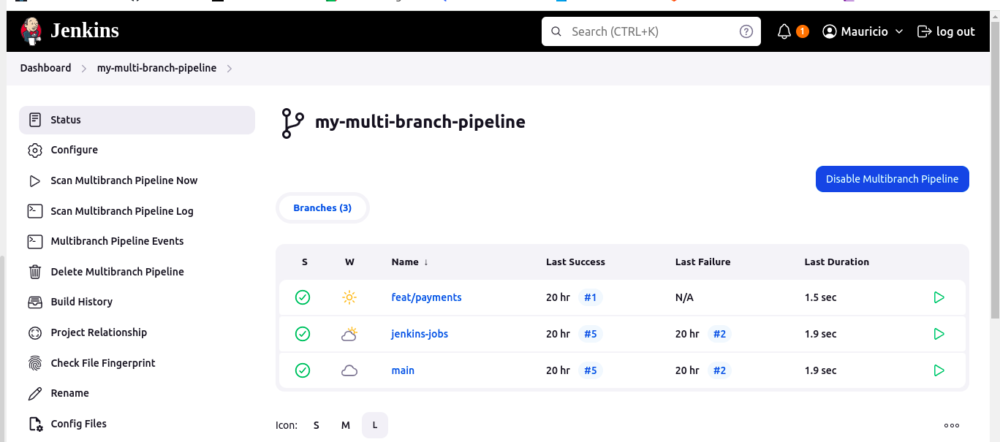
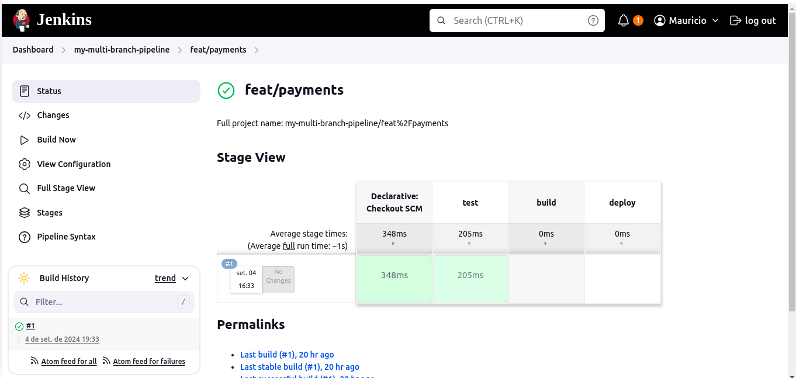
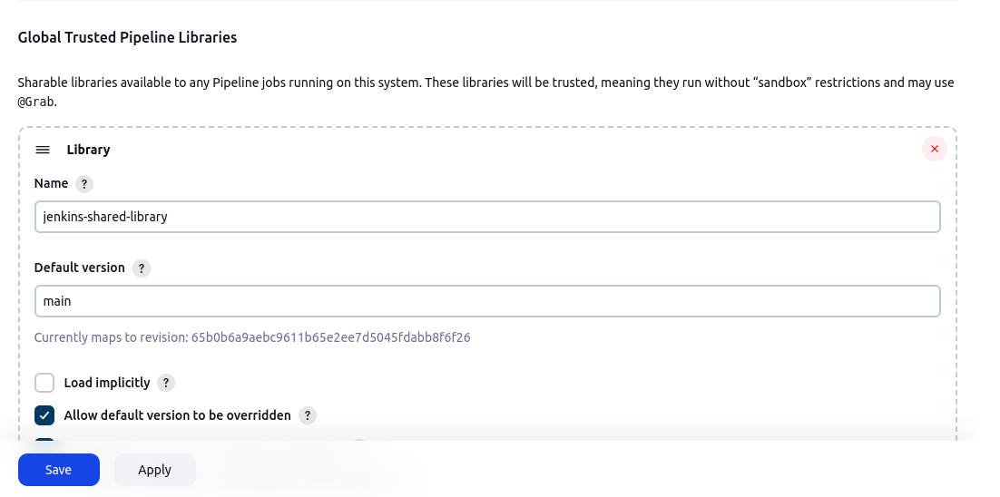
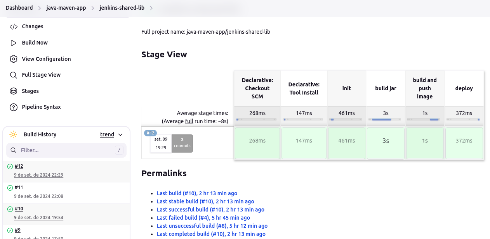

# Demo Project 1

Install Jenkins on DigitalOcean

## Technologies Used

Jenkins, Docker, DigitalOcean, Linux

## Project Description

- Create an Ubuntu server on DigitalOcean
- Set up and run Jenkins as Docker container
- Initialize Jenkins

### Details of project

- Create new server on Cloud

  A new server was created with a minimum of 2 vCPUs and 4 GB of RAM to host Jenkins. In this case, I used an AWS EC2 instance. Port 8080 was opened in the firewall to allow access to 
  Jenkins via a browser.

- Install docker on server to run Jenkins

  The first step was to install Docker on this new server, and then run the following command:

  ```
  docker run -p 8080:8080 -p 50000:50000 -d -v jenkins_home:/var/jenkins_home jenkins/jenkins:lts
  ```
  
  This command pulls Jenkins from Docker Hub, running on port 8080 and using a volume named jenkins_home. Port 50000 is used for the connection between the master and nodes. With this setup, 
  Jenkins can be accessed in the browser using the public IP of the EC2 instance.

- Initialize Jenkins

  The first screen displayed by Jenkins prompted for an initial password, which is located at: /var/jenkins_home/secrets/initialAdminPassword.

  

  After entering the password, the recommended plugins were installed, and a new user and password were configured. Jenkins is now ready to be used on this server.

  

# Demo Project 2

Create a CI Pipeline with Jenkinsfile (Freestyle, Pipeline, Multibranch Pipeline)

## Technologies Used

Jenkins, Docker, Linux, Git, Java, Maven

## Project Description

CI Pipeline for a Java Maven application to build and push to the repository
- Install Build Tools (Maven, Node) in Jenkins
- Make Docker available on Jenkins server
- Create Jenkins credentials for a git repository
- Create different Jenkins job types (Freestyle, Pipeline, Multibranch
  pipeline) for the Java Maven project with Jenkinsfile to:
    a. Connect to the application’s git repository
    b. Build Jar
    c. Build Docker Image
    d. Push to private DockerHub repository

### Details of project

- Install Build Tools
  Maven was installed using Jenkins plugins (version 3.9.2, named maven-3.9). Node was installed via curl: curl -sL https://deb.nodesource.com/setup_20.x -o nodesource_setup.sh

- Make Docker available on Jenkins server
  To enable Docker within the Jenkins server, a volume was mounted to /var/run/docker.sock. The updated docker run command is:
  
  ```
  docker run -p 8080:8080 -p 50000:50000 -d -v jenkins_home:/var/jenkins_home -v /var/run/docker.sock:/var/run/docker.sock jenkins/jenkins:lts
  ```
  After this, while inside the container as the root user, Docker was installed by running the following commands:

  ```
  curl https://get.docker.com/ > dockerinstall && chmod 777 dockerinstall && ./dockerinstall
  ```
  This script fetches the latest version of Docker and sets the appropriate permissions for the installation file. Additionally, to ensure Jenkins can access the Docker socket, the following   permission was applied:
  ```
  chmod 666 /var/run/docker.sock
  ```
  
- Create Jenkins credentials for a git repository
  I used a Git repository to store the files for this project. Credentials are required to allow the Jenkins pipeline to access external services such as GitHub, GitLab, and Docker Hub. The    Git and Docker Hub credentials were created through the Jenkins UI.

  From this point, different types of pipelines were created to build the JAR files and Docker images, which were then pushed to Docker Hub. These pipelines will be explained in the sections below.

  ## Freestyle Job

  The freestyle pipeline was created and configured with single tasks. One stage checks the npm version using a shell script, while another stage invokes top-level Maven targets to    verify the Maven version. After running successfully, the pipeline was connected to a GitHub repository to execute a script within a specific branch.

  

  ## Complete Pipeline

  In this step, a pipeline was created and configured using a Jenkinsfile located in a branch named jenkins-jobs within the GitHub repository. This pipeline contains four stages:

  - Initialize: A Groovy script is initialized, containing the commands to be used in the following stages.    
  - Build: The Java application is built using mvn package with an installed tool.
  - Docker Image: The Docker image is built using stored credentials to log in to Docker Hub. The image is then pushed to a private Docker Hub repository with versioning set to jma-1.1.
  - Deploy: A stage simulates the deployment of the application by returning a message indicating the deployment.

  

  ## Multibranch Pipeline

  In this configuration, the setup is almost identical to the previous pipeline. However, this time the pipeline is configured to match all branches of the repository. Each       
  branch has its own pipeline that runs independently, displaying results in separate consoles. For this run, three GitHub branches were used: main, jenkins-jobs, and 
  feat/payments.
  
  

  All branches contains identical Jenkins files, which were recognized and executed by the pipeline. The image stage has pull in docker hub with versioning set to jma-2.0.
  
  

  Additionally, a condition was added to the build and deploy stages so that they only run in the main branch. The other branches correctly skipped these stages.

  

# Demo Project 3

Create a Jenkins Shared Library

## Technologies Used

Jenkins, Groovy, Docker, Git, Java, Maven

## Project Description

Create a Jenkins Shared Library to extract common build logic:
- Create separate Git repository for Jenkins Shared Library project
- Create functions in the JSL to use in the Jenkins pipeline
- Integrate and use the JSL in Jenkins Pipeline (globally and for a specific project in Jenkinsfile)

### Details of project

  - Create separate repository and prepare the functions to be called in jenkinsfile
    
  In the beginning of the project, a separated repository was created in Github to host the Jenkins Shared Library. The groovy scripts will be 
  created inside a vars folder in the root. The name of the files needs to be the same name of the functions used to be called in the pipeline. 
  One of the functions created was the buildJar.
  ```
  #!/user/bin/env groovy

    def call() {
      echo "building the application..."
      sh 'mvn package'
    }
  ```
  The first line of the code has the purpose to the editor to recognize the groovy script. A similar function was created in a separated file 
  named buildImage. Both of them needs to be called in the Jenkins file:
  
  ```
        stage("build jar") {
            steps {
                script {
                    buildJar()
                }
            }
        }

        stage("build image") {
            steps {
                script {
                    buildImage()

                }
            }
        }
  ```
   In order to run this pipeline, the Shared Library Repository needs to be avaiable in Jenkins. It was configured in Manage Jenkins > System > 
   Global Pipelne Libraries, adding the repository url, versioning with the main branch, and the credentials fot authentication.

   

   This configuration allows Jenkins to use the Shared Libraries in all pipelines, but in further steps, another configuration will be done. Now     this library needs to be declared in Jenkinsfile.
  
   ```
    @Library('jenkins-shared-library')
    def gv
   ```
  - Add variables in functions
    
     The pipeline runned successfully with these previous configurations. Besides that, some improvements were done. One of the then was to add 
     environment variables to used when calling the functions of the Shared Library. The buildImage function was updated in the code below:
  
     ```
     def call(String imageName) {
        echo "building the docker image..."
        withCredentials([usernamePassword(credentialsId: 'docker-hub-repo', passwordVariable: 'PASS', usernameVariable: 'USER')]) {
        sh "docker build -t $imageName ."
        sh 'echo $PASS | docker login -u $USER --password-stdin'
        sh "docker push $imageName"
        }
      }
     ```

     A variable named imageName was passed as a parameter to the function to simplify some docker commands in order to avoid code repetition. The Jenkins file contains the string that willl      be passed to this function:
  
     ```
      stage("build image") {
              steps {
                  script {
                      buildImage 'mauriciocamilo/demo-app:jma-3.0'
                  }
              }
          }
     ```

  - Creating a Class
    
    Another improvement made in this project was the creation of a Class in the Shared Library. It is a separated file in the src folder that 
    extracts all the commands from the functions, which will be used as a way between the Jenkinsfile and the Shared Library.

     ```
      #!/user/bin/env groovy
      package com.example

      class Docker implements Serializable {

        def script

        Docker(script) {
          this.script = script
        }
      }
     ```
     This is the structure of the class. It contains the name of the package, the Class call, and the script configuration in order to use commands to run the pipelines. The Jenkins file         still calls the functions of the groovy script, but now these scripts will call the Class. Here is a exaaple of the groovy function

      ```
      #!/user/bin/env groovy
      
      import com.example.Docker
      def call(String imageName) {
          return new Docker(this).buildDockerImage(imageName)
      }
     ```
    By doing this configuration, two more functions were created by groovy scripts, each of then executes a docker command, and the Jenkinsfile will call all of then in a single stage:
    
    ```
      stage("build and push image") {
        steps {
          script {
            buildImage 'mauriciocamilo/demo-app:jma-3.0'
            dockerLogin()
            dockerPush 'mauriciocamilo/demo-app:jma-3.0'
          }
        }
      }
    ```
    The final result of this method is that the Jenkinsfile is a very clean file, with properly functions that explains what is executed in each stage, and all the logic was concentrated in     the class created in the Shared Library. The pipeline also runned successfully with this configuration:
    
    
